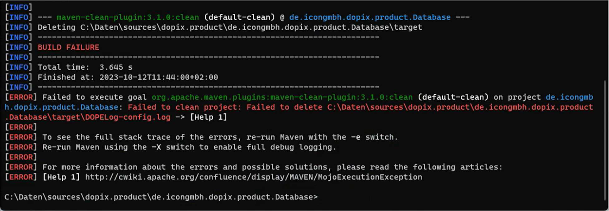
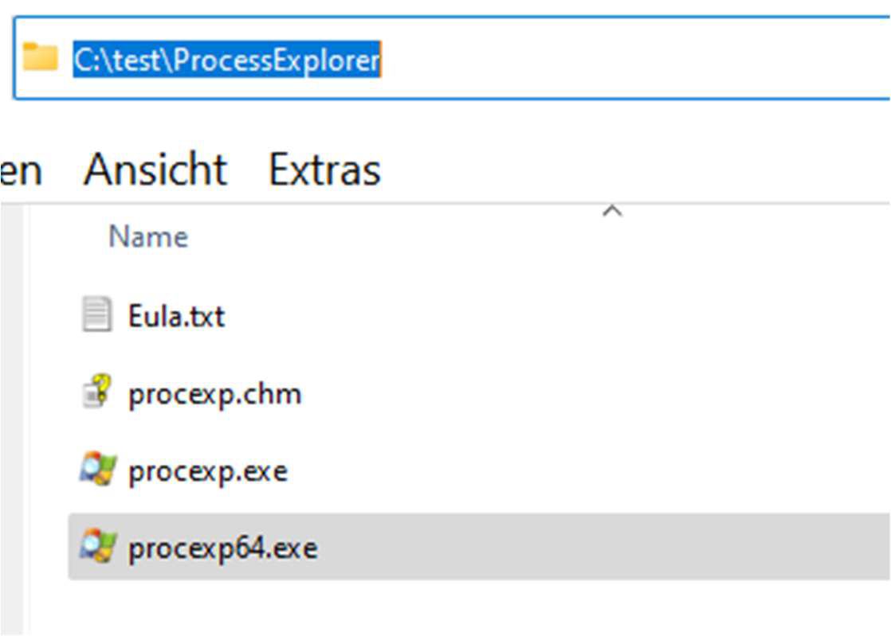
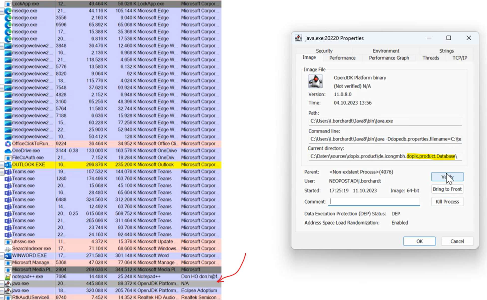

# Materiais-Lista-Ferramentas-Uteis
Neste repositório estao listadas ferramentas e aplicativos úteis no desenvolvimento de software, assim como algumas dicas práticas para setar o ambiente. 

## **Plugins Eclipse**
- **EasyShell**: Permite abrir um projeto diretamente no Windows Explorer ou no terminal de comando dieramente a partir do Eclipse (Clique com botão direito do mouse sobre elemento do Project Explorer e selecionar EasyShell).

## **Process-Explorer**
~~~
https://learn.microsoft.com/de-de/sysinternals/downloads/process-explorer#download
~~~  

**Exemplo de Uso**   

- Fehler: Eine Instance des Projekts läuft schon

- Lösung: Instance Kiln

- Check ob das Java Process Current directory *dopix.product.* ist . Wenn ja den der Process
löschen.

## **VisualVM**
~~~
https://visualvm.github.io/download.html
~~~ 

## Beyond Compare 4
~~~
https://www.scootersoftware.com/download/v4
~~~

## PSPad
~~~
https://www.pspad.com/en/download.htm
~~~ 