# Criando um Documento no Dopix

1. Clique em DOPLIST

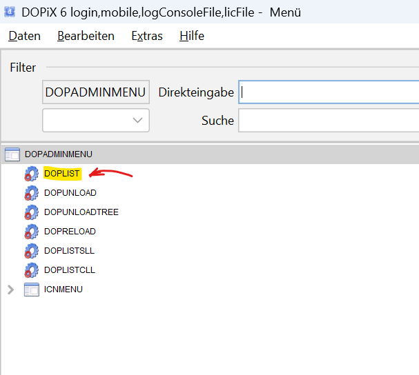

2. Clieque em Bearbeiten>Neu

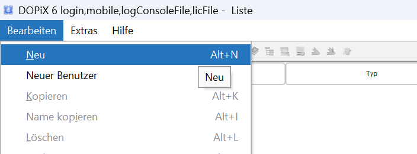

3. Dê um nome ao Objeto (com Sufixo _LTD), selecione o tipo Dokumentvorlage e clique Anlegen und Bearbeiten

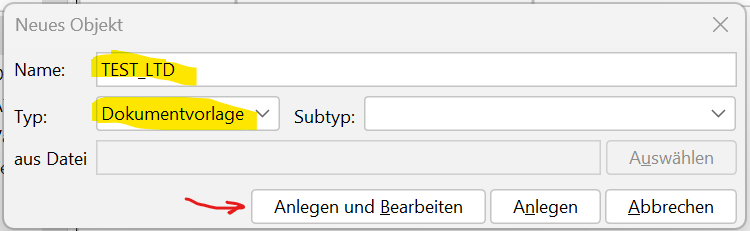

4. Entre com o nome do Baustein em "Name" e dê Enter. Selecione o Tipo "Baustein" e clique Anlegen und Bearbeiten

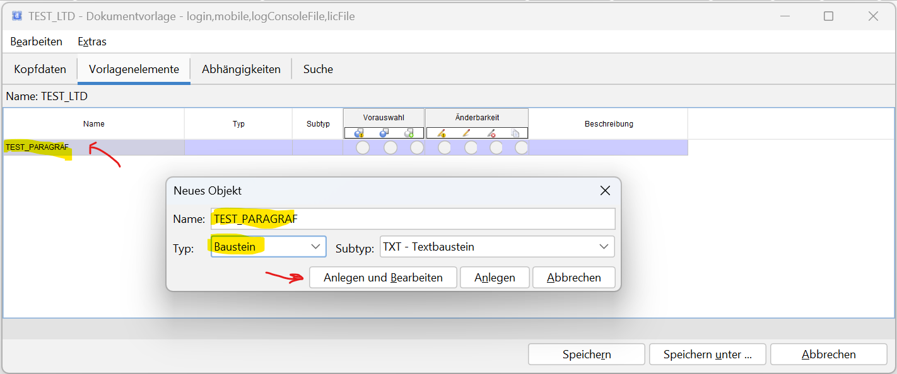

5. Na aba Parameter crie algumas variáveis com valores padrao  

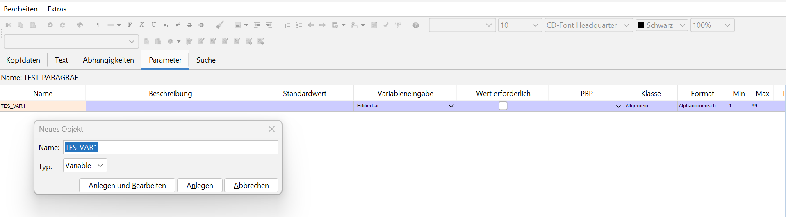

6. Edite o texto do parágrafo.

- Para adicionar uma variável ao texto use &<Nome_VAR>. (o PONTO irá traduzir a String em variável)

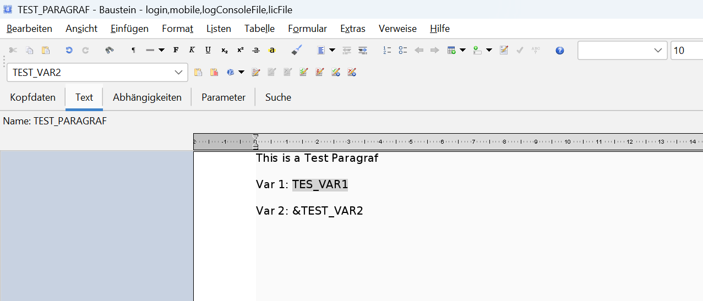

7. Dokumentvorlage Ausführen 

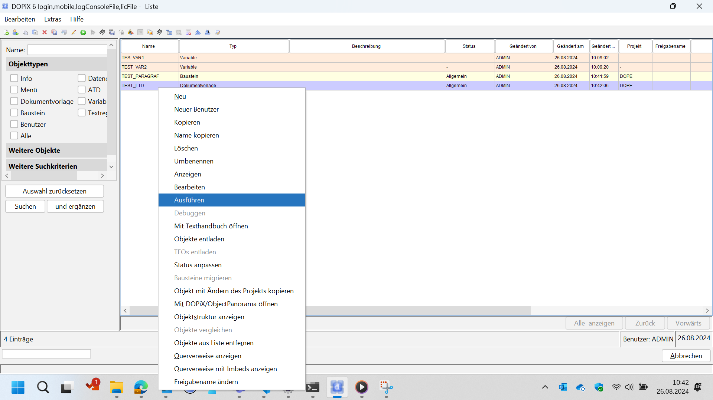

8. Weiter - Fertigstellen

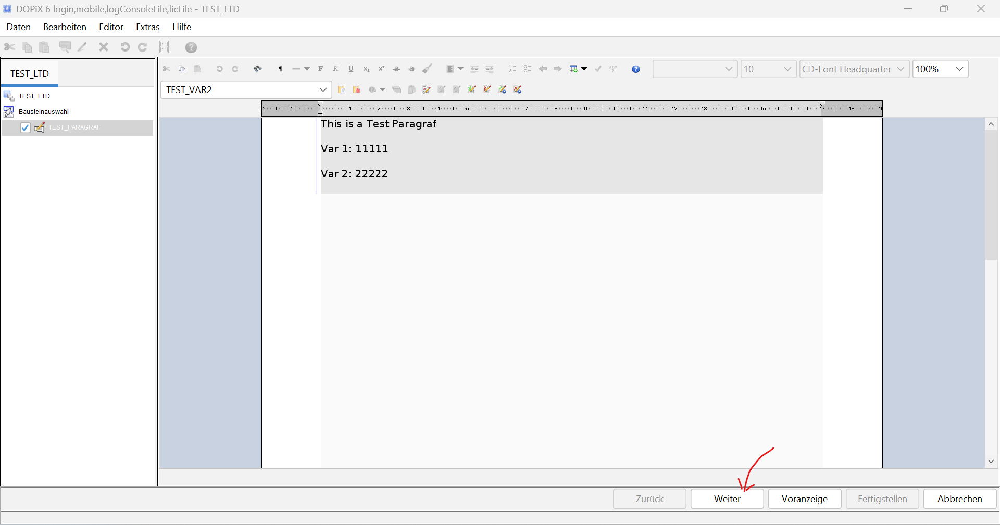

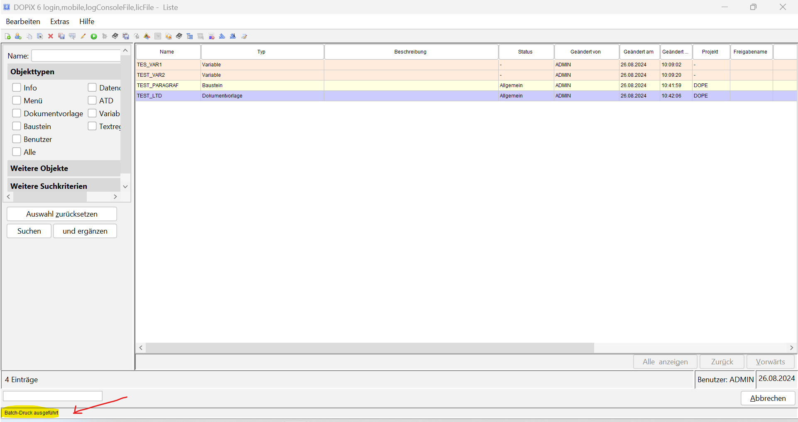

9. Consultando o documento gerado com DOCLISTCLL

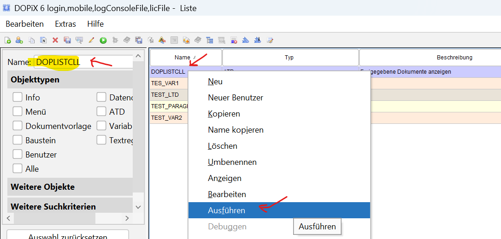

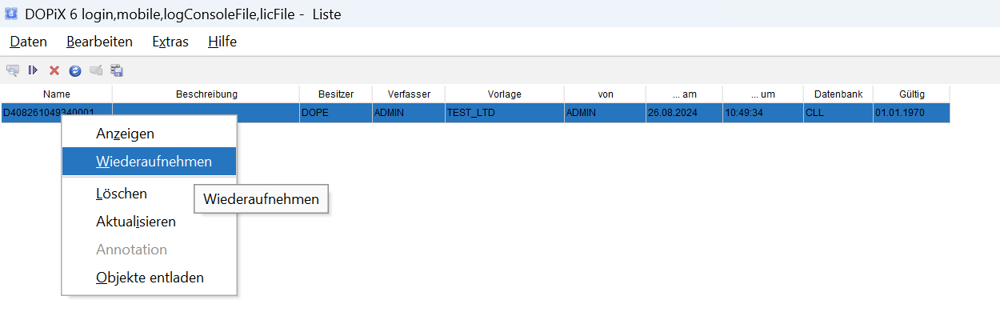

# Load Objects 

- Carregar objetos exportados (arquivo .dsf): 

1. Abra o menu DOPLIST
2. Arraste e solte o arquivo .dsf do lado esquerdo da tela
3. Na tela que se abrir clie em weiter e os objetos serao carregados

