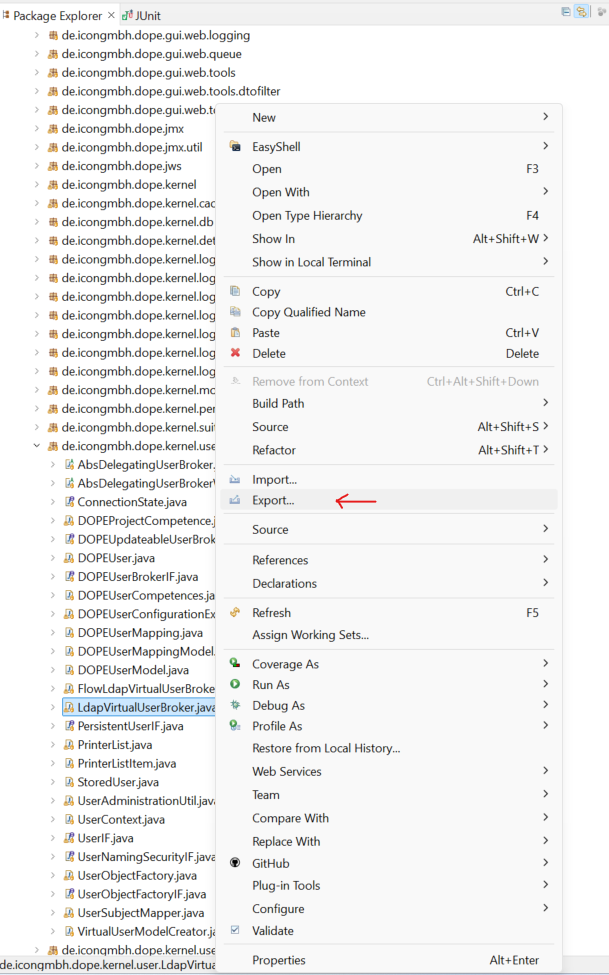

# Ativando o Debbug

1. Ative o Debugger nas configuracoes da instancia do Dopix: 

- **Opcao A:** Abra o arquivo wrapper_environment_customer.conf
~~~
    C:\IJB\Tests\de.icongmbh.dopix.release.package-6.0.49-SNAPSHOT\dopix_mobile\mobile\dopixdb\config\wrapper\wrapper_environment_customer.conf
~~~

- Adicione os seguintes parametros às configuracoes existentes: 
~~~conf
#wrapper.java.additional.2000=-Dibm.cl.verbose=de.icongmbh.dope.main.DopixServerApplication
#wrapper.java.additional.2001=-Dibm.cl.verbose=*
wrapper.java.additional.2002=-agentlib:jdwp=transport=dt_socket,server=y,address=8000,suspend=y
~~~

- **Opcao B:** Abra o arquivo login_mobile.bat 
~~~
    C:\IJB\Tests\de.icongmbh.dopix.release.package-6.0.51-SNAPSHOT\dopix_mobile\mobile\dopix\bin\mobile\login_mobile.bat
~~~

- Adicione a seguinte linha de comando: 

~~~bat
set DOPJVM_OPTS=-agentlib:jdwp=transport=dt_socket,server=y,address=8000,suspend=y
~~~

- **A string de parametros**
~~~
    -agentlib:jdwp=transport=dt_socket,server=y,address=8000,suspend=y
~~~

- Mais detalhes sobre a configuracao do Debugger podem ser consultados em:
~~~
    C:\IJB\Tests\de.icongmbh.dopix.release.package-6.0.49-SNAPSHOT\dopix_mobile\mobile\dopixdb\bin\setEnvironment_customer.bat
~~~

2. Adicionando o código alterado na lib para ser debugado

Por estarmos debugando remotamente, o código fonte no Eclipse pode nao corresponder ao código da versao da instância do DOPIX, dessa forma é necessário exportar o código alterado para um biblioteca jar e adicionar esta biblioteca no comeco do Classpath (importante ser no comeco para que esta biblioteca tenha prioridade sobre as demais na execucao).   

No DOPIX há 3 scripts relacionados à montagem do Classpath:  
    - classpath.bat : define o diretório de onde as biliotecas jar serao instanciadas (..\dopix_mobile\mobile\dopix\lib);   
    - setEnvironment_customer.bat : Aqui sao definidas as bibliotecas jar de teste que serao adiconadas no comeco do classpath;  
    - iconBase.bat : junta das variáveis de ambiente criadas nos 2 scripts acima.   

- Passo 1. **Ajustando Classpath:** No arquivo setEnvironment_customer.bat, habilitar as linhas "set DOPEFIRST_LIBS_PATH=%LIBS_PATH%"  e  "set DOPEFIRST_JARS..."
~~~
    C:\IJB\Tests\de.icongmbh.dopix.release.package-6.0.51-SNAPSHOT\dopix_mobile\mobile\dopix\bin\setEnvironment_customer.bat
~~~
~~~bat
REM -------------------------------------------------------------------------------------------
REM ---  _                     _
REM --- (_) ___ ___  _ __     | | __ _ _ __ ___
REM --- | |/ __/ _ \| '_ \ _  | |/ _` | '__/ __|
REM --- | | (_| (_) | | | | |_| | (_| | |  \__ \
REM --- |_|\___\___/|_| |_|\___/ \__,_|_|  |___/
REM --- Definition of additional libraries

REM --- 1.) set the path to the additional libraries
REM EXAMPLE (use default libpath):
    set DOPEFIRST_LIBS_PATH=%LIBS_PATH%
rem set DOPEFIRST_LIBS_PATH=%LIBS_PATH%

REM --- 2.) set the list of customer libraries (Windows ;)
set DOPEFIRST_JARS=%DOPEFIRST_JARS%;%DOPEFIRST_LIBS_PATH%\dopeTestFix_1.jar
rem set DOPEFIRST_JARS=%DOPEFIRST_JARS%;%DOPEFIRST_LIBS_PATH%\dopeTestFix_2.jar
~~~
- Passo 2. **Exportando o jar de testes**

- Passo 3. **Adicionando o Jar Exportado à biblioteca de Jars do Dopix**

Copie o arquivo dopeTestFix_1.jar, exportado no passo anteriror, para: 
~~~
    C:\IJB\Tests\de.icongmbh.dopix.release.package-6.0.51-SNAPSHOT\dopix_mobile\mobile\dopix\lib
~~~

- Passo 4. **Verificando o Classpath efetivo:** Caso haja suspeitas de que a biblioteca nao tenha sido adicionada ao Classpath verifique o log da execucao (DOPELog-config-log):
~~~
C:\IJB\Tests\de.icongmbh.dopix.release.package-6.0.51-SNAPSHOT\dopix_mobile\mobile\dopix\log\mobile\Login_externalDB.log
~~~

No nosso exemplo vêmos qe a biblioteca dopeTestFix_1.jar foi adicionada no comeco do Classpath.
~~~
>java.class.path=;.\config;;.\lng;;.\lib\dopeTestFix_1.jar;.\lib\dopeTest.jar;.\lib\dopeFixes.jar;.\lib\dopeCustom.jar;;.\lib\windows-x86-64\cpjdope.jar;.\lib\windows-x86-64\wrapper.jar;;;.\lib\activation-1.1.
~~~

3. Configurando o Debugger no Eclipse

- Eclipse>Run>Debug Configurations
- Clique com Botao direito do mouse sobre "Remote Java Application" e selecione "New Configuration"
- Ajustar as propriedades Host e Port, se necessário
    - HOST: Localhost 
    - PORT: 8000 

# Log4j

## Mostrar os comandos SQL no log 

- Alterar o arquivo log4j2.xml (..\mobile\dopixdb\config) e adicionar o filtro SQL conforme abaixo: 
~~~
  <Filters>
    <MarkerFilter marker="HEARTBEAT" onMatch="ACCEPT" onMismatch="NEUTRAL"/>
    <MarkerFilter marker="CONFIG_STATIC" onMatch="ACCEPT" onMismatch="NEUTRAL"/>
	<MarkerFilter marker="SQL" onMatch="ACCEPT" onMismatch="NEUTRAL"/>
  </Filters>
~~~

