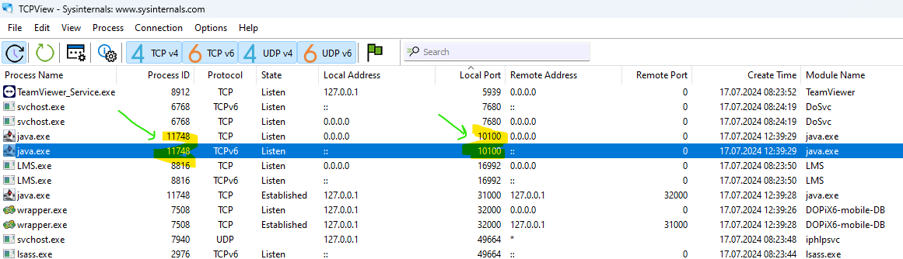
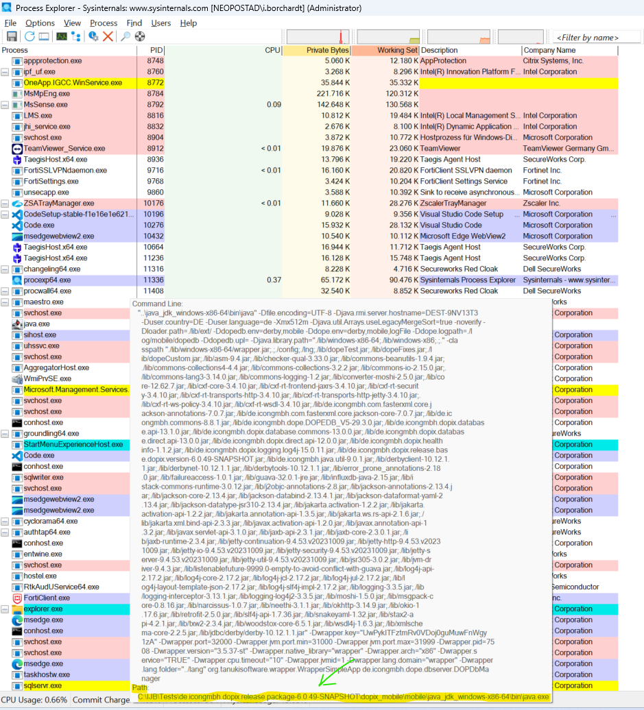
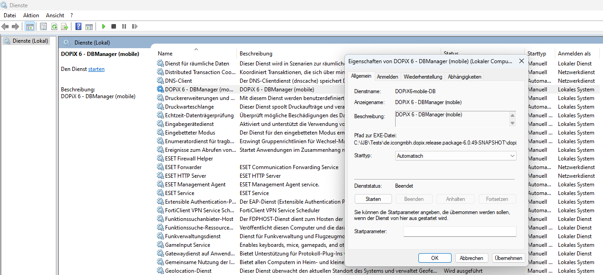

# Resolvendo Problemas de Porta em uso 

## O Problema 

- Ao iniciar o DBManager do Dopix ocorre erro por que a porta IP está em uso por outro servico:  

~~~
jvm 1    | 2024-07-17 12:40:27.941 [E]  de.icongmbh.dope.dbserver.DOPDbManager 29.3.1 (2406131155-1417203d) execute WrapperSimpleAppMain (:)
jvm 1    |   java.lang.RuntimeException: Couldn't start IP-Listener for DOPE/DB Server
jvm 1    |      at de.icongmbh.dope.dbserver.DOPDbManager.initializeIpListener(DOPDbManager.java:539)
jvm 1    |      at de.icongmbh.dope.dbserver.DOPDbManager.init(DOPDbManager.java:470)
jvm 1    |      at de.icongmbh.dope.dbserver.DOPDbManager.execute(DOPDbManager.java:220)
jvm 1    |      at de.icongmbh.dope.dbserver.DOPDbManager.main(DOPDbManager.java:166)
jvm 1    |      at sun.reflect.NativeMethodAccessorImpl.invoke0(Native Method)
jvm 1    |      at sun.reflect.NativeMethodAccessorImpl.invoke(NativeMethodAccessorImpl.java:62)
jvm 1    |      at sun.reflect.DelegatingMethodAccessorImpl.invoke(DelegatingMethodAccessorImpl.java:43)
jvm 1    |      at java.lang.reflect.Method.invoke(Method.java:498)
jvm 1    |      at org.tanukisoftware.wrapper.WrapperSimpleApp.run(WrapperSimpleApp.java:349)
jvm 1    |      at java.lang.Thread.run(Thread.java:750)
jvm 1    | Caused by: java.net.BindException: Address already in use: JVM_Bind
jvm 1    |      at java.net.DualStackPlainSocketImpl.bind0(Native Method)
jvm 1    |      at java.net.DualStackPlainSocketImpl.socketBind(DualStackPlainSocketImpl.java:106)
jvm 1    |      at java.net.AbstractPlainSocketImpl.bind(AbstractPlainSocketImpl.java:387)
jvm 1    |      at java.net.PlainSocketImpl.bind(PlainSocketImpl.java:190)
jvm 1    |      at java.net.ServerSocket.bind(ServerSocket.java:390)
jvm 1    |      at java.net.ServerSocket.bind(ServerSocket.java:344)
jvm 1    |      at de.icongmbh.commons.net.socket.ServerSocketHelper.applyUnboundBind(ServerSocketHelper.java:55)
jvm 1    |      at de.icongmbh.commons.net.socket.ServerSocketFactory.createServerSocket(ServerSocketFactory.java:112)
jvm 1    |      at de.icongmbh.dopix.net.socket.easy.ServerSocketpp.createAndBind(ServerSocketpp.java:67)
jvm 1    |      at de.icongmbh.dopix.net.socket.easy.ServerSocketpp.createAndBind(ServerSocketpp.java:52)
jvm 1    |      at de.icongmbh.dope.dbserver.ServerSocketListener.initializeListener(ServerSocketListener.java:49)
jvm 1    |      at de.icongmbh.dope.dbserver.DOPDbManager.initializeIpListener(DOPDbManager.java:532)
jvm 1    |      ... 9 more
~~~

## Diagnóstico/Solucao 

1. Verificar qual é a porta configurada para o DBManager que se deseja iniciar (dopedb.properties): 

~~~
# ------------------------------------------------------------------------------
# Stage: mobileDev (Derby)
# ------------------------------------------------------------------------------
mobileDev.dope.dbserver.ipPort          = 11100
~~~

2. No TCPView:

- Identificar o Processo que está rodando na porta 11100 
- Anotar o Process ID

3. No Process Explorer: 

- Identificar o processo através do Process ID 
- Deixar o ponteiro do mouse descansar sobre o processo para ver mais detalhes 

- Nos detalhes do processo pode-se ver o Path do processo

4. No caso deste exemplo percebeu-se que ao derrubar o processo outro iniciava automaticamente. Isso aconteceu por que o DBManager foi acidentalmente instalado como Service e estava por padrao setado para iniciar autmatiamente.  

**Solucao:** Parar o servico e setá-lo para iniciar manualmente (botao direito do mouse)

