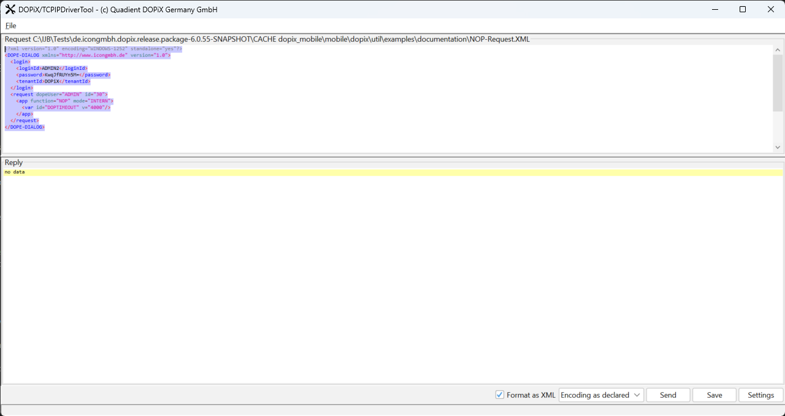

# Cache de password 

## Criar novos Usuários

- Desmarcar a opcao "Externe Kennwotprüfung" para permitir que a senha seja alterada na tela de inicializacao

## Habilitar a alteracao de Senha 
- Para testar o Cache de Senha será preciso alterar a senha 

- Em ..\dopix_mobile\mobile\dopix\config\dope.properties  
~~~
dope.login.changePassword = true  
~~~

## Alterar o tempo de atualizacao do Cache 

~~~
#--------------------------------------------------------------------------------
# Configuration: Permanent Cache
#--------------------------------------------------------------------------------
dope.system.userid                    = ADMIN

dope.cache.permanent.file.name        = dopecache.dsf
dope.cache.permanent.file.path        = ${DOP:dope.temp.path}/cache
dope.cache.permanent.schedule         = 3600
dope.cache.permanent.mode             = AUTO

dope.cache.update.interval            = 120
dope.userCache.update.interval        = 30

login.dope.cache.update.interval      = 60
login.dope.cache.unavailables.isAware = false

~~~

## Testando o Update do Cache 

### Habilitando o Recording 

1. Adicionar a String "recording" ao \dopix\bin\mobile\login_mobile.bat

~~~bat
    set DOPENV=login,%DOPSTAGE%,logConsoleFile,licFile,recording 
~~~

### Habilitando o log do cache

~~~
    \dopix\config\log4j2.xml
~~~

- Adicionar a propriedade marker="CACHE" em todos os lugares onde a TAG MarkerFilter aparece.
~~~XML
    <MarkerFilter marker="CACHE" onMatch="ACCEPT" onMismatch="NEUTRAL"/>
~~~

### Verificando se o Cache está habilitado 

- No recording: 

- Cache Request no log: 

## Trigger Mobile

### Preparando o trigger_mobile para rodar
1. Assim como no Dopix mobile, será necessário habilitar o licFile e recording no \dopix\bin\mobile\trigger_mobile.bat

~~~bat
    set DOPENV=%DOPSTAGE%,connIp,logConsoleFile,licFile,recording
~~~

2. Para debugar também será necessário setar as opcoes de debuge remoto em \dopix\bin\setEnvironment_customer.bat

~~~bat
    REM    Options for remote debugging (SUN J2SE 5.x)
    SET       DOPJVM_OPTS=-agentlib:jdwp=transport=dt_socket,server=y,address=8000,suspend=y
~~~

## Testando o Cache

### Enviando um Request com DriverToolIp.bat

- Rodar o Script DriverToolIp.bat  
~~~
    \dopix\util\DriverToolIp.bat 
~~~
 

- Na pasta \dopix\util\examples\documentation há diversos exemplos de requests que podem ser usados como base. Para fins de teste criamos um resquest NOP enviando as credenciais do usuário. 
- **Importante** notar que o valor na Tag password está codificado e corresponte em texto plano à "admin". 
~~~XML
<?xml version="1.0" encoding="WINDOWS-1252" standalone="yes"?>
<DOPE-DIALOG xmlns="http://www.icongmbh.de" version="1.0">
  <login>
    <loginId>ADMIN2</loginId>
    <password>KwqJfRUYn5M=</password>
    <tenantId>DOPiX</tenantId>
  </login>
  <request dopeUser="ADMIN" id="30">
    <app function="NOP" mode="INTERN">
      <var id="DOPTIMEOUT" v="4000"/>
    </app>
  </request>
</DOPE-DIALOG>

~~~

- Ao enviar o request as credenciais enviadas serao comparadas com as credenciais que estao armazenadas no cache, caso o cache nao seja atualizado após a troca da senha (o que configuraria um erro), o login deverá ser rejeitado. 

