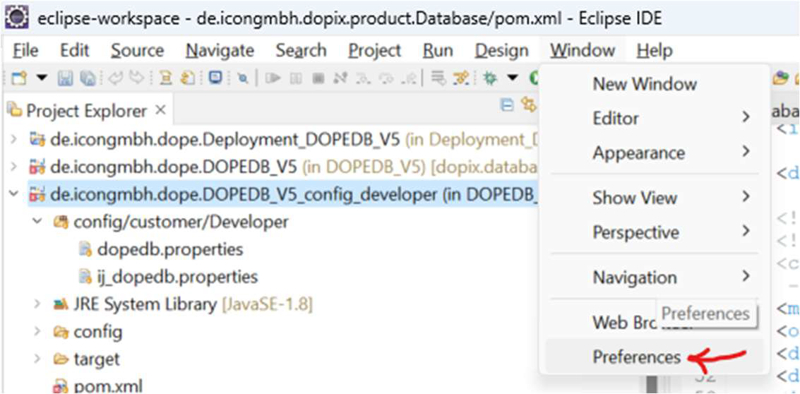
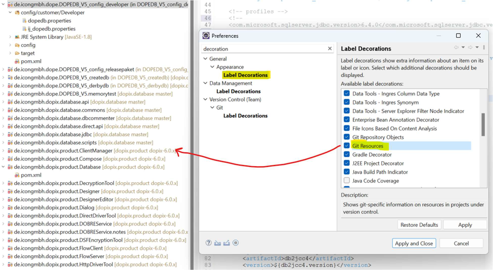
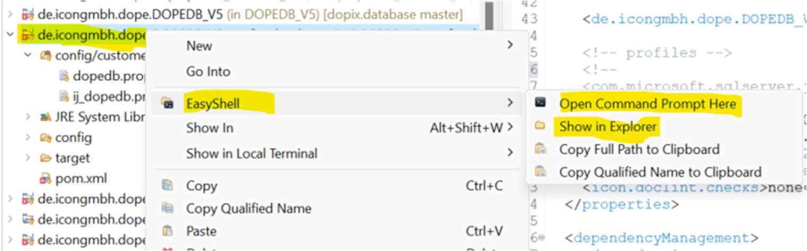
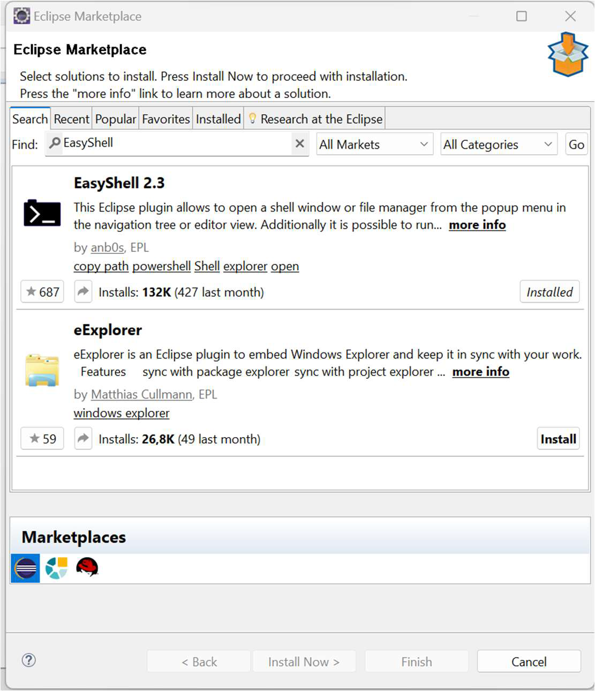

# Eclipse
## Atalhos importantes

- Localizar Método 
~~~
Ctrl + O 
~~~

- Localizar Classe 
~~~
Ctrl + F3
~~~

- ??? 
~~~
Ctrl + Shift + R
~~~

- ???
~~~
Ctrl + Shift + G
~~~

- ???
~~~
Ctrl + Shift + T
~~~

- Auto Format 
~~~
Ctrl + Shift + F
~~~

## DBUG

- F8 - Resume
- F5 - Step Into 
- F6 - Step Over
- Ctrl + Alt + B - Skip All Breakpoints 

## Chamar o eclipse com cache limpo 

C:\Users\i.borchardt\eclipse\jee-2023-09\eclipse\eclipse -clean

## Aumentar a memória do eclipse 

- Navegue até o diretório onde se encontra o eclipse.exe e abra o arquivo eclipse.ini

~~~
C:\Users\i.borchardt\eclipse\jee-2023-09\eclipse
~~~

- Aumente a memória do eclipse na opcao "-Xmx"

~~~ini
-startup
plugins/org.eclipse.equinox.launcher_1.6.500.v20230717-2134.jar
--launcher.library
C:\Users\i.borchardt\.p2\pool\plugins\org.eclipse.equinox.launcher.win32.win32.x86_64_1.2.700.v20221108-1024
-product
org.eclipse.epp.package.jee.product
-showsplash
C:\Users\i.borchardt\.p2\pool\plugins\org.eclipse.epp.package.common_4.29.0.20230907-1200
--launcher.defaultAction
openFile
--launcher.appendVmargs
-vm
C:/Users/i.borchardt/.p2/pool/plugins/org.eclipse.justj.openjdk.hotspot.jre.full.win32.x86_64_17.0.8.v20230831-1047/jre/bin
-vmargs
-Dosgi.requiredJavaVersion=17
-Dosgi.instance.area.default=@user.home/eclipse-workspace
-Dosgi.dataAreaRequiresExplicitInit=true
-Dorg.eclipse.swt.graphics.Resource.reportNonDisposed=true
-Dsun.java.command=Eclipse
-Xms256m
-Xmx4096m
-XX:+UseG1GC
-XX:+UseStringDeduplication
--add-modules=ALL-SYSTEM
-Declipse.p2.max.threads=10
-Doomph.update.url=https://download.eclipse.org/oomph/updates/milestone/latest
-Doomph.redirection.index.redirection=index:/->https://raw.githubusercontent.com/eclipse-oomph/oomph/master/setups/
--add-opens=java.base/java.lang=ALL-UNNAMED
~~~

## Git Branch in Project Explorer ersichtlich machen

## EasyShell

## Switch Branch

