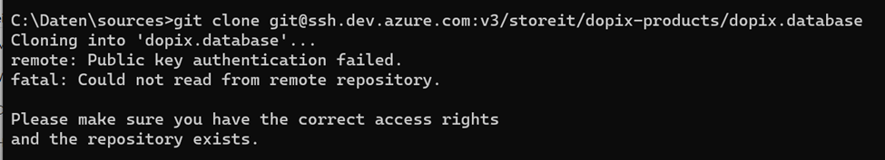
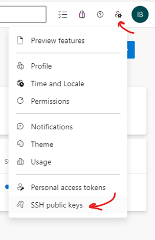
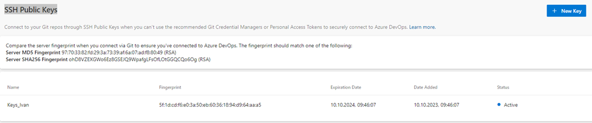
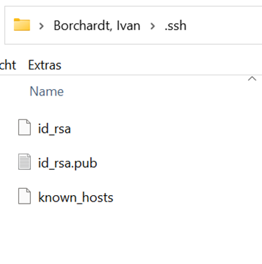
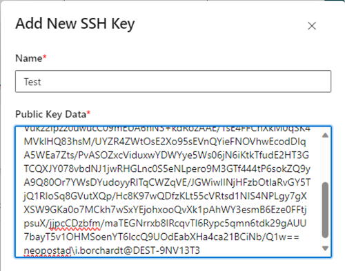
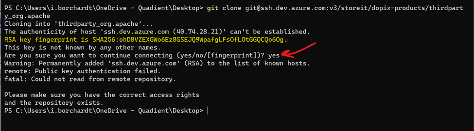
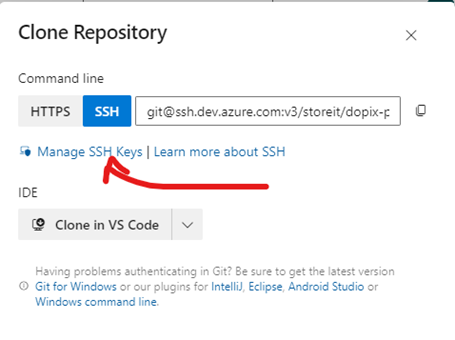
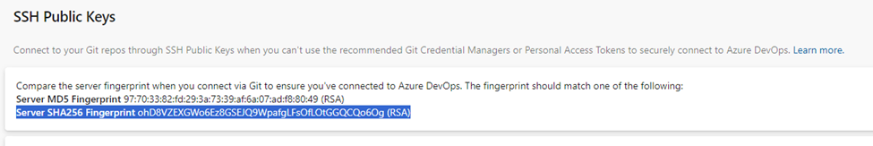
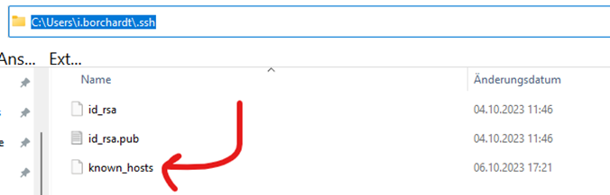

# Autenticacao em repositórios remotos 

- Para usar o protocolo ssh é necessário gerar um par de chaves público/privada, onde a chave pública será registrada no servidor e a privada ficará na máquina do usuário. Caso isso ainda nao tenha sido feito o usuário receberá a seguinte mensagem ao tentar acessar o repositório remoto do projeto:  




## Gerar Chaves SSH

1. **Abra o terminal**: No seu computador, abra o terminal ou prompt de comando.

2. **Digite o comando**:
   ```sh
   ssh-keygen -b 4096
   ssh-keygen -t rsa -b 4096 -C "seu_email@example.com"
   ```
   O parâmetro `-b 4096` especifica que a chave deve ter 4096 bits, o que aumenta a segurança.

3. **Escolha o local para salvar a chave**: Você será solicitado a escolher um local para salvar a chave. O padrão é `~/.ssh/id_rsa`. Pressione `Enter` para aceitar o local padrão ou digite um caminho diferente.

4. **Digite uma senha (opcional)**: Você pode definir uma senha para proteger a chave privada. Se não quiser usar uma senha, apenas pressione `Enter`.

5. **Confirme a senha**: Se você definiu uma senha, será solicitado a confirmá-la.

Após seguir esses passos, você terá duas chaves geradas:
- **Chave privada**: Geralmente salva como `id_rsa` no diretório `~/.ssh`.
- **Chave pública**: Geralmente salva como `id_rsa.pub` no mesmo diretório.

A chave pública (`id_rsa.pub`) é a que você deve adicionar aos servidores ou serviços que deseja acessar via SSH.


---
### Valid keys will start with "ssh-rsa" no Azure ao adicionar a chave pública 

Isso pode acontecer se a chave pública gerada não estiver no formato esperado pelo Azure. O Azure requer que as chaves SSH estejam no formato RSA com um comprimento mínimo de 2048 bits


Aqui estão alguns passos para garantir que sua chave SSH esteja no formato correto:

1. **Gerar a chave SSH**:
   ```sh
   ssh-keygen -t rsa -b 4096 -C "seu_email@example.com"
   ```
   O parâmetro `-t rsa` especifica que a chave deve ser do tipo RSA.

2. **Verificar o formato da chave pública**:
   Após gerar a chave, verifique o conteúdo do arquivo `id_rsa.pub` (ou o nome que você escolheu). A chave pública deve começar com `ssh-rsa`.

3. **Adicionar a chave ao Azure**:
   Certifique-se de copiar a chave pública corretamente ao adicionar ao Azure. 

Se a chave pública não começar com `ssh-rsa`, pode haver algum problema na geração ou na cópia da chave. Tente regenerar a chave seguindo os passos acima.

Se precisar de mais ajuda, estou aqui para ajudar! 😊

[1](https://learn.microsoft.com/en-us/azure/virtual-machines/linux/create-ssh-keys-detailed): [Detailed steps to create an SSH key pair - Azure Virtual Machines](https://learn.microsoft.com/en-us/azure/virtual-machines/linux/create-ssh-keys-detailed)
[2](https://learn.microsoft.com/en-us/azure/virtual-machines/ssh-keys-portal): [Create SSH keys in the Azure portal - Azure Virtual Machines](https://learn.microsoft.com/en-us/azure/virtual-machines/ssh-keys-portal)

---

## Adicionando a chave pública no Azure



- Clicar em Nova Chave 



- Copiar o conteúdo do arquivo id_rsa.pub e adicionar ao campo "Public Key Data"





## Fingerprint 

- No primeiro acesso será pedida uma confirmacao se RSA key Fingerprint apresentado corresponde ao Fingerprint registrado no Azure 
- Verifique se está correto, veja nos passos seguintes e confirme com "yes" 



- Veja a chave RSA SHA256 em "Gerenciar Chaves SSH" e compare com a chave exibida.





- Depois disso, um arquivo known_hosts será criado automaticamente no diretório .ssh. No próximo clone, não será mais feita nenhuma pergunta.
