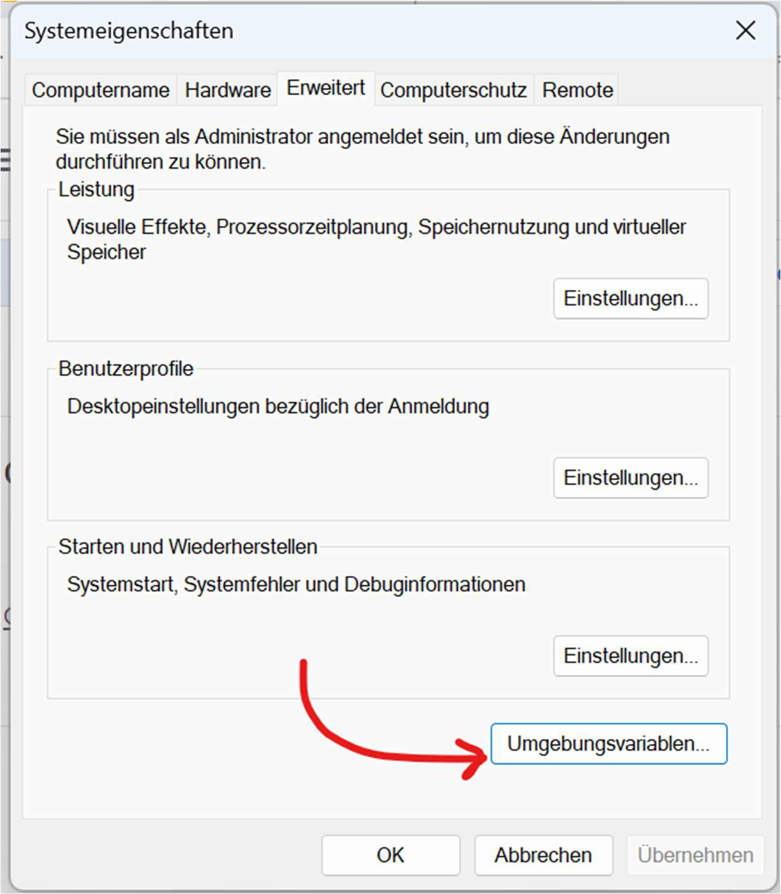
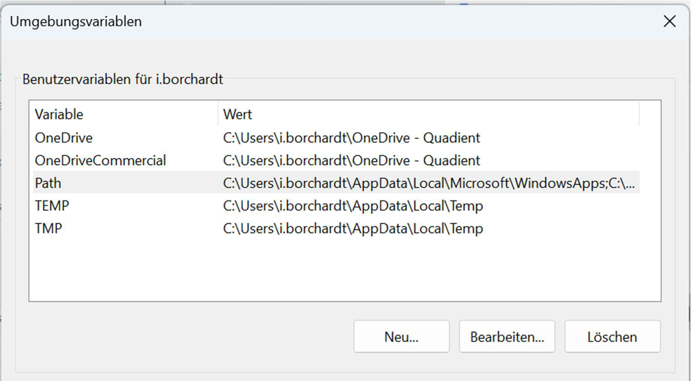
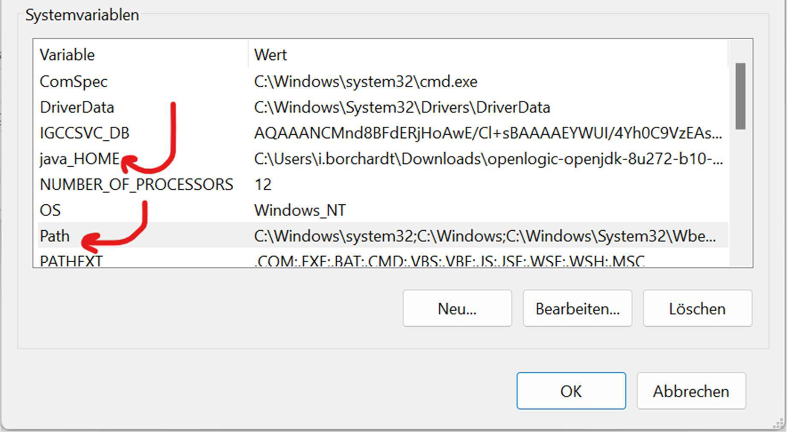
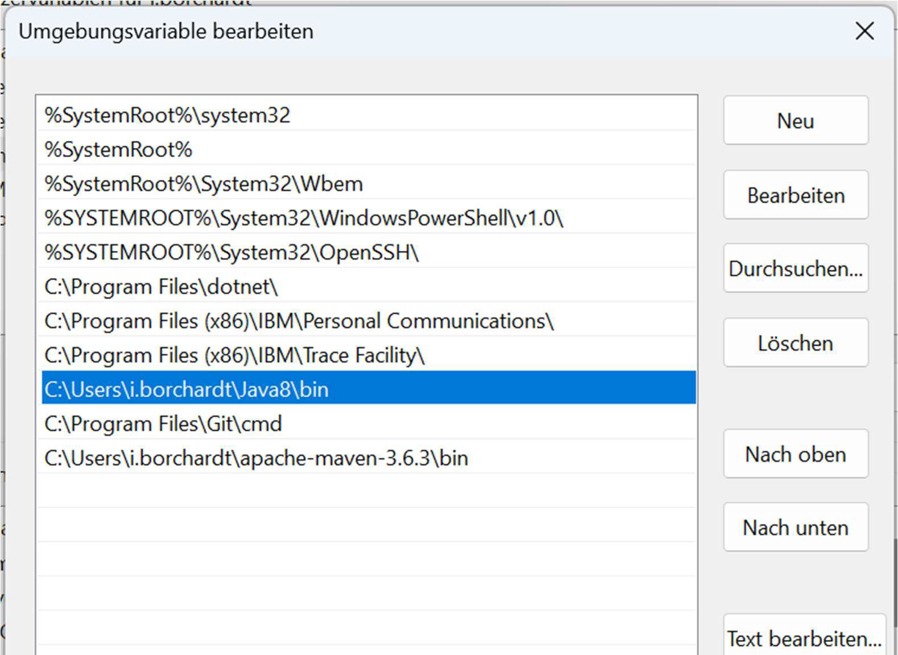
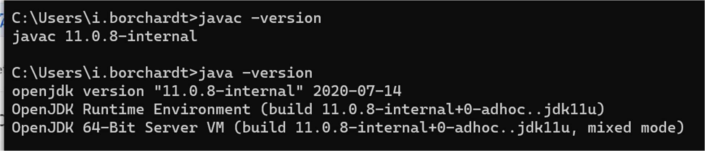

# Java SDK

## **Download OpenSDK** 

## **Como instalar o OpenJDK 11 no Windows**

- https://qastack.com.br/programming/52511778/how-to-install-openjdk-11-on-windows

### **Configurar Variáveis de ambiente**

### **Verificar Versão Ativa do Java**

### **Trabalhando com diferentes versões do Java** 

- Crie um arquivo .bat com o Script abaixo para setar as veriáveis de ambiente de forma rápida e dinâmica toda vez que for necessário usar uma versao diferente do Java: 

~~~bat
set JAVA_HOME=C:\IJB\Resources\JAVA\jdk-11.0.16.1+1
set path = C:\IJB\Resources\JAVA\jdk-11.0.16.1+1\bin;%path%
~~~