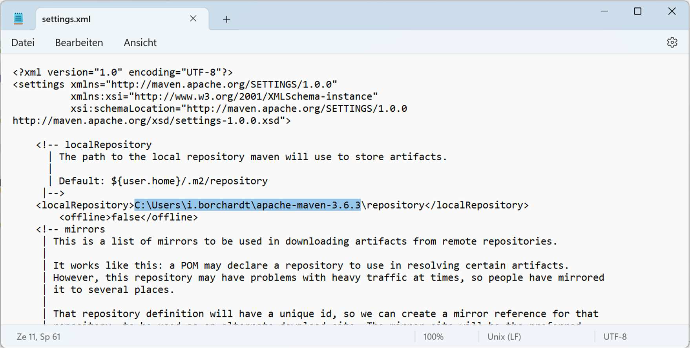

# Maven 3.6.3

1. Download Maven 3.6.3
2. Instalar Java JDK 7 ou mais novo 
3. Configurar variável de ambiente
- **PATH:** C:\Users\i.borchardt\apache-maven-3.6.3\bin

4. Testar se o Maven está corretamente instalado  
- command>mvn 

5. Configurar o Settings.xml
- In Settings.xml unter C:\Users\i.borchardt\.m2 ist der localRepository anzupassen, so
dass der Repository unter den Installationsverzeichnis angelegt wird:

6. Atualizar reporitório Maven 
- command> mvn verify

## **Maven command Guide**
https://jenkov.com/tutorials/maven/maven-commands.html

## Comandos mvn úteis 

mvn clean install --settings="C:\DEV\Sources\dopix.pipelines.resources\resources\settings.xml"
mvn clean install --settings="C:\DEV\Sources\dopix.pipelines.resources\resources\settings.xml" -DargLine="--add-opens java.base/java.lang=ALL-UNNAMED"
mvn clean install --settings "C:\DEV\Sources\dopix.pipelines.resources\resources\settings.xml" -DargLine="--add-opens java.base/java.lang=ALL-UNNAMED"

mvn clean install -DskipTests --settings="C:\DEV\Sources\dopix.pipelines.resources\resources\settings.xml"

mvn dependency:tree -Dincludes=:hibernate-core --settings="C:\DEV\Sources\dopix.pipelines.resources\resources\settings.xml"

mvn test --settings="C:\DEV\Sources\dopix.pipelines.resources\resources\settings.xml"

mvn help:evaluate -Dexpression=icon.dependency.work -q -DforceStdout